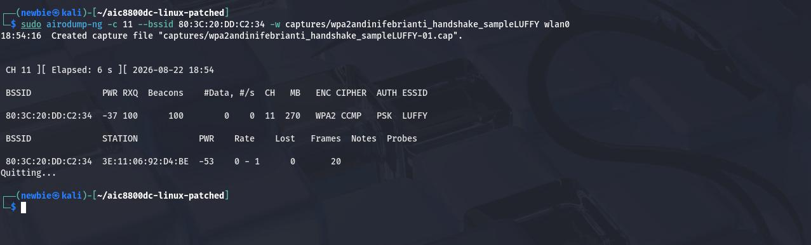
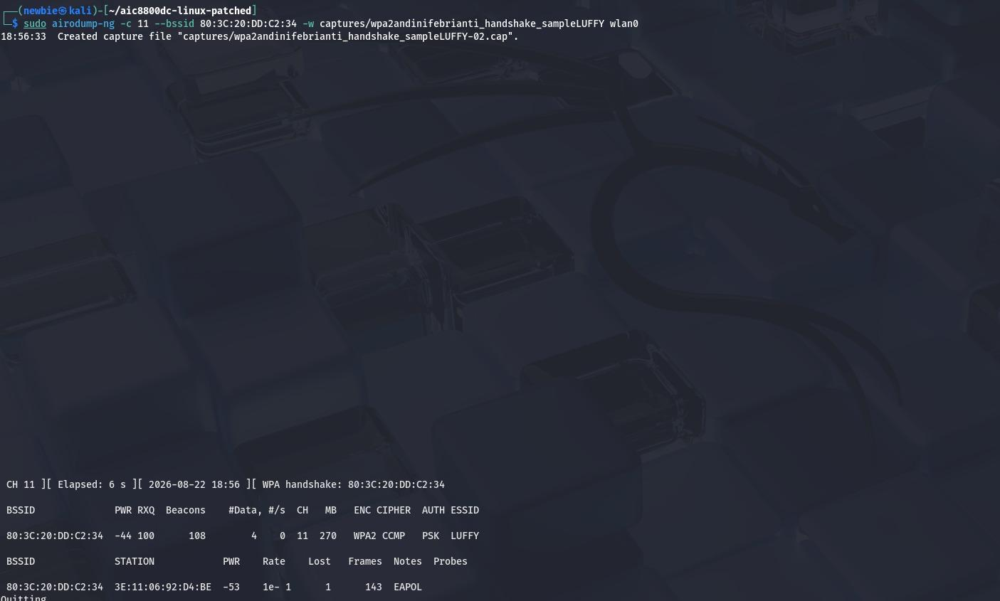
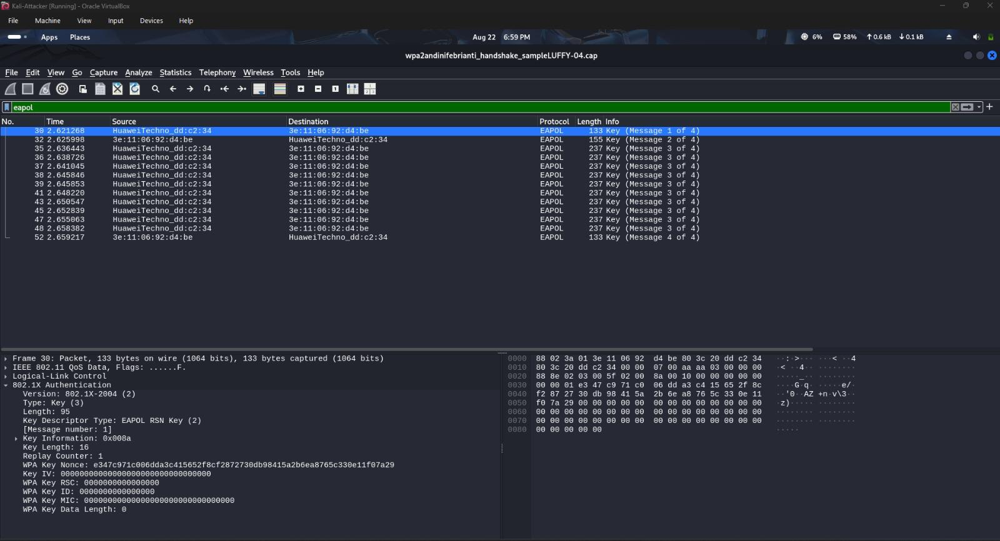
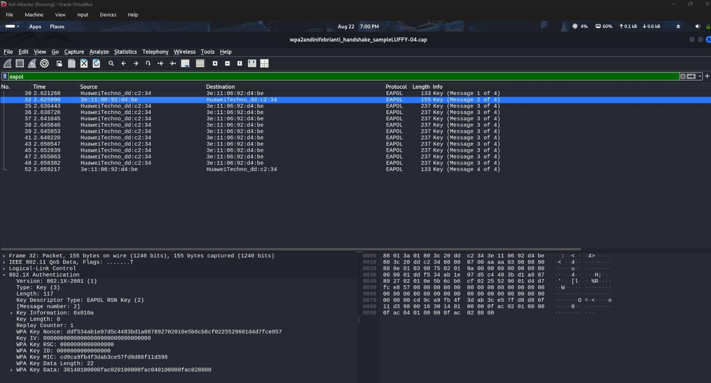
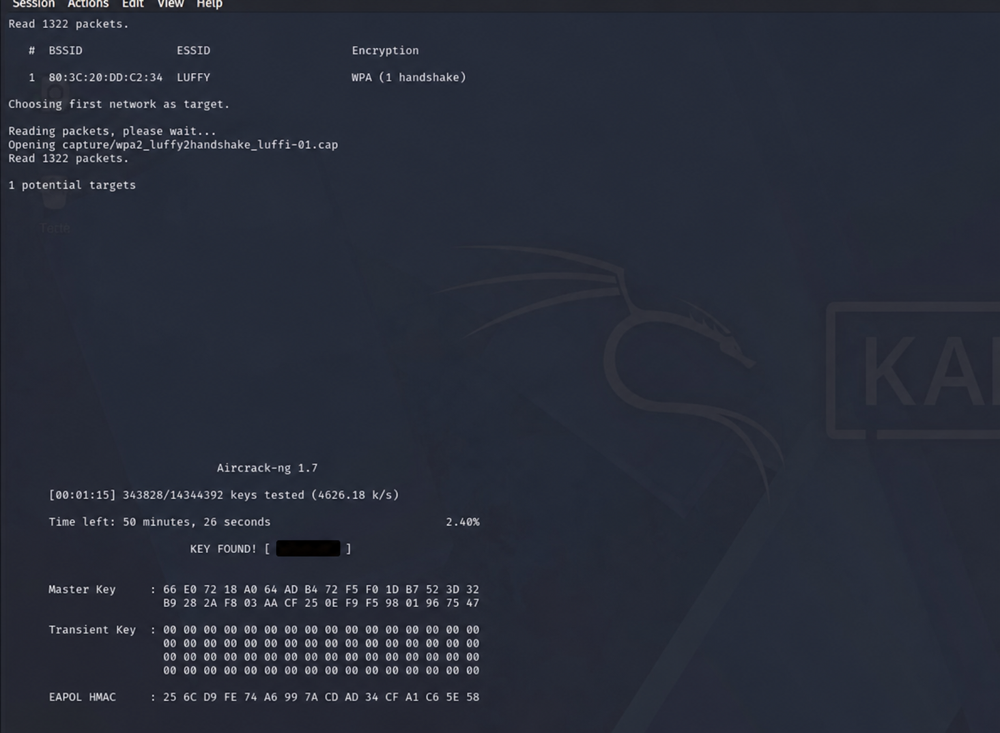

# Analisis Keamanan Jaringan WiFi WPA2 Menggunakan Aircrack-ng dan Wireshark

Repository ini berisi dokumentasi praktikum **analisis keamanan jaringan WiFi WPA2** menggunakan Kali Linux, Aircrack-ng, Airodump-ng, dan Wireshark. Praktikum dilakukan pada jaringan laboratorium yang dimiliki sendiri atau telah memperoleh izin pengujian.

> [!IMPORTANT]
> Materi ini dibuat hanya untuk kebutuhan pendidikan dan pengujian keamanan yang sah. Informasi kata sandi pada dokumentasi telah disamarkan dan tidak boleh digunakan untuk mengakses jaringan tanpa izin.

## Tujuan Praktikum

1. Memantau jaringan WPA2 pada kanal dan BSSID yang telah ditentukan.
2. Menangkap proses autentikasi WPA2 4-way handshake.
3. Menampilkan dan menganalisis paket EAPOL menggunakan Wireshark.
4. Mengidentifikasi tahapan Message 1 dan Message 2 dalam proses handshake.
5. Mengevaluasi ketahanan passphrase laboratorium menggunakan wordlist.

## Perangkat dan Aplikasi

- Kali Linux
- Oracle VirtualBox
- Adaptor WiFi yang mendukung monitor mode
- Aircrack-ng suite
- Airodump-ng
- Wireshark

## Dokumentasi Praktikum

### 1. Pemantauan Target WPA2

Airodump-ng digunakan untuk memantau access point laboratorium pada kanal yang telah ditentukan. Tampilan menunjukkan informasi BSSID, kekuatan sinyal, kanal, jenis enkripsi WPA2, cipher CCMP, metode autentikasi PSK, serta perangkat klien yang terhubung.



### 2. Penangkapan WPA2 Handshake

Indikator `WPA handshake` pada bagian kanan atas menunjukkan bahwa paket autentikasi antara access point dan klien berhasil tertangkap dan disimpan ke dalam file capture.



### 3. Pemeriksaan Paket EAPOL di Wireshark

File capture dibuka menggunakan Wireshark, kemudian paket difilter dengan kata `eapol`. Hasilnya memperlihatkan rangkaian paket WPA2 4-way handshake yang terdiri atas Message 1 sampai Message 4.



### 4. Analisis EAPOL Message 2

Message 2 merupakan respons klien terhadap Message 1 yang dikirim oleh access point. Paket ini membawa nonce dari klien dan Message Integrity Code (MIC) untuk membantu proses pembentukan serta validasi kunci sesi.



### 5. Validasi Ketahanan Passphrase

Aircrack-ng digunakan untuk mengevaluasi ketahanan passphrase jaringan laboratorium terhadap wordlist. Hasil pengujian menunjukkan bahwa passphrase sederhana lebih mudah ditemukan melalui serangan berbasis kamus. Nilai passphrase pada gambar telah disamarkan.



## Hasil Analisis

| Tahap | Hasil |
|---|---|
| Pemantauan jaringan | Access point WPA2 dan perangkat klien berhasil terdeteksi. |
| Penangkapan handshake | WPA2 4-way handshake berhasil ditangkap dan disimpan. |
| Analisis Wireshark | Paket EAPOL Message 1–4 berhasil ditampilkan. |
| Pemeriksaan paket | Message 1 dan Message 2 dapat diidentifikasi melalui detail EAPOL. |
| Validasi wordlist | Passphrase sederhana terbukti rentan terhadap pengujian berbasis kamus. |

## Rekomendasi Keamanan

1. Gunakan passphrase panjang, unik, dan tidak terdapat dalam kamus umum.
2. Gunakan WPA2-AES atau WPA3 jika perangkat mendukung.
3. Nonaktifkan WPS apabila tidak diperlukan.
4. Perbarui firmware access point secara berkala.
5. Jangan membagikan file capture atau kredensial jaringan kepada pihak yang tidak berwenang.

## Struktur Repository

```text
.
├── README.md
└── dokumentasi/
    ├── 01-pemantauan-target-wpa2.jpeg
    ├── 02-penangkapan-wpa2-handshake.jpeg
    ├── 03-daftar-paket-eapol-wireshark.jpeg
    ├── 04-detail-eapol-message-2.jpeg
    └── 05-validasi-wordlist-aircrack-ng.png
```

## Kesimpulan

Praktikum membuktikan bahwa WPA2 4-way handshake dapat diamati melalui paket EAPOL dan dianalisis menggunakan Wireshark. Keamanan jaringan WPA2 tidak hanya bergantung pada protokol enkripsi, tetapi juga pada kekuatan passphrase serta konfigurasi access point. Penggunaan passphrase yang panjang dan unik menjadi langkah penting untuk mengurangi risiko serangan berbasis wordlist.

## Etika Penggunaan

Seluruh pengujian wajib dilakukan pada jaringan milik sendiri atau jaringan yang telah memberikan izin tertulis. Pengguna bertanggung jawab mematuhi hukum, kebijakan institusi, dan prinsip etika keamanan siber.
